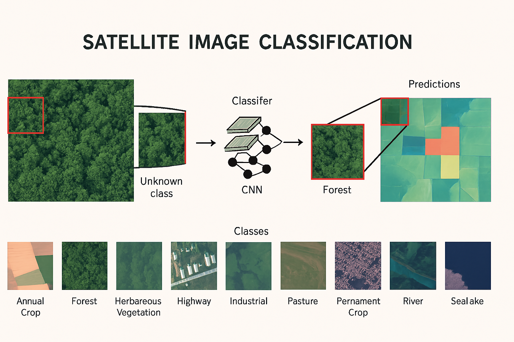
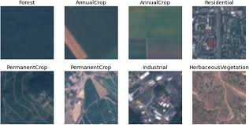
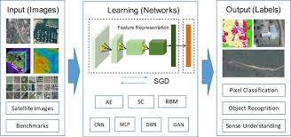
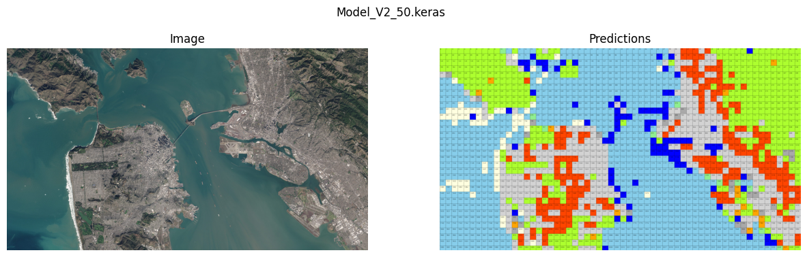
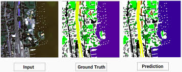

# 🌍 Satellite Image Classification using a CNN

## ✅ Overview

This project demonstrates the classification of satellite images using a custom Convolutional Neural Network (CNN). The model is designed to classify images from the **EuroSAT dataset** into ten distinct classes.



---

## 📂 Table of Contents

1. [Introduction](#introduction)
2. [Dataset](#dataset)
3. [Methodology](#methodology)

   * [Data Preprocessing](#data-preprocessing)
   * [Model Building](#model-building)
   * [Model Training](#model-training)
   * [Model Evaluation](#model-evaluation)
   * [Optimizing Model Performance](#optimizing-model-performance)
4. [Results](#results)
5. [Conclusion](#conclusion)
6. [Future Work](#future-work)
7. [Installation](#installation)
8. [Usage](#usage)
9. [Contact](#contact)

---

## 📌 Introduction

Satellite image classification plays a crucial role in applications such as **land cover mapping**, **urban planning**, and **environmental monitoring**. This project leverages **deep learning (CNNs)** to classify satellite images into ten categories:
**AnnualCrop, Forest, HerbaceousVegetation, Highway, Industrial, Pasture, PermanentCrop, Residential, River, SeaLake.**

---

## 🗂 Dataset

We use the **EuroSAT dataset**, which contains **27,000 labeled images** of various land use and land cover types. Each image is **64x64 pixels** and categorized into:

* AnnualCrop
* Forest
* HerbaceousVegetation
* Highway
* Industrial
* Pasture
* PermanentCrop
* Residential
* River
* SeaLake

---

## ⚙️ Methodology

### **Data Preprocessing**

✔ Normalization: Pixel values scaled to \[0, 1]
✔ Tensor conversion
✔ One-Hot encoding for labels
✔ Train-Validation-Test Split
✔ Data Augmentation: flips, brightness adjustments

### **Model Building**

A custom CNN **SpectrumNet** with multiple convolutional layers, **Batch Normalization**, and **ReLU activation**.



### **Model Training**

* Optimizer: **SGD with momentum**
* Loss: **Categorical Cross-Entropy**
* Early Stopping & Learning Rate Scheduler

### **Model Evaluation**

Evaluated on **accuracy, confusion matrix**, and tested for generalization.

### **Optimizing Performance**

Achieved **96% accuracy** on the test set.

---

## 📊 Results

Sample predictions and confusion matrices were generated.





## ✅ Conclusion

CNN-based classification provides **high accuracy** for satellite image tasks. Proper **data preprocessing**, **model tuning**, and **evaluation** are key for success.

---

## 🔮 Future Work

* Use **higher-resolution images**
* Explore **transfer learning**
* Increase dataset size with **augmentation**

---

## 🔧 Installation

Clone the repository:

```bash
git clone https://github.com/gaurib124/Satellite-Image-Classification.git
cd Satellite-Image-Classification
```

Install dependencies:

```bash
pip install -r requirements.txt
```

---

## ▶ Usage

Run the **GUI application**:

```bash
python classifierApp.py
```

Steps:
✔ **Select Model**: Load a `.keras` model file
✔ **Select Image**: Choose the image to classify
✔ **View Results**: Displays the classification result

---


## 📩 Contact

* **Name:** Gauri D. Bhagyawant
* **Email:** [gauribhagyawant@gmail.com](mailto:gauribhagyawant@gmail.com)
* **GitHub:** [https://github.com/gaurib124](https://github.com/gaurib124)
* **LinkedIn:** [https://www.linkedin.com/in/gauri-bhagyawant-088410263/](https://www.linkedin.com/in/gauri-bhagyawant-088410263/)

---

✅ **Feel free to fork, star ⭐ and contribute!**

=======
# Satellite-Image-Classification
Satellite Image Classification using CNN – A deep learning project that classifies satellite images into 10 land cover categories (e.g., sea, lake, highway, forest). Built with TensorFlow/Keras and Tkinter, it features dynamic model selection, real-time predictions, and an interactive GUI.
